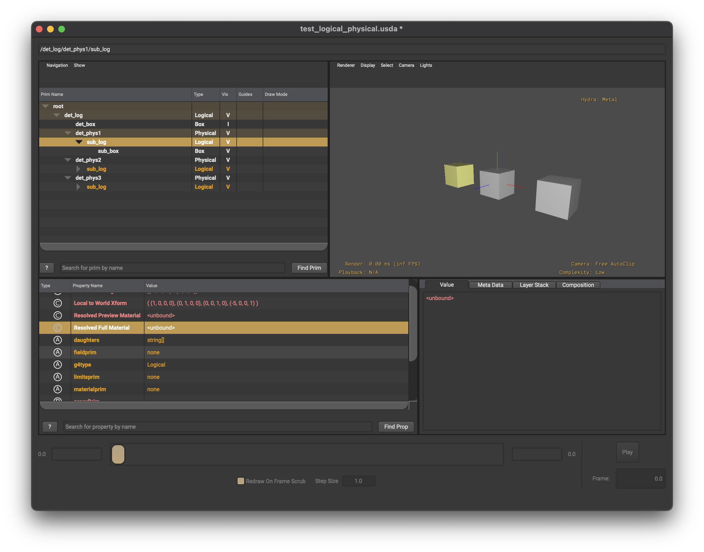

### Introduction

USD is a modern composition file format used by 3D workflows.
It is increasing being used in engineering/physics applications 
via NVIDIA Omniverse. 

### Aims

1. Renderble USD file
2. Direct load to Geant4
3. As similar structure as GDML/G4
4. Dynamic update of boolean/references

### Quick build instructions

* clone openusd 
  * `terminal> git clone https://github.com/PixarAnimationStudios/OpenUSD.git `
* clone g4omniverse 
  * `terminal> git clone https://github.com/g4edge/g4omniverse.git`
* Move to openusd directory 
  * `terminal> cd openusd`
* Link g4omniverse schema to extras directory 
  * `terminal> ln -s ../g4omniverse/schema openusd/extras/g4`
* edit `extras/CMakeLists.txt` to include g4 directory
* build plugin 
  * `terminal> python build_scripts/build_usd.py ../openusd-build/`
* add plugin directory to python path
  * `terminal> export $PYTHONPATH=$PYTHONPATH:<PATH_TO_USD_BUILD>/lib/python`
* test in python 
  * `python> from pxr import G4`

### Regenerate schema

* `usdGenSchema g4.schema .`

### Add listeners in usdview

* `from pxr.G4 import utils`
* `utils.add_listeners()`
* `pxr.G4.BooleanSolid.InstallUpdateListeners()`

### Convert usd file to usdz

Need to flatten custom schema file for conversion to USDZ

* `usdcat -o INPUT_flatten.usda --flatten INPUT.usda`
* `usdzip INPUT_flatten.usda INPUT_flatten.usdz`